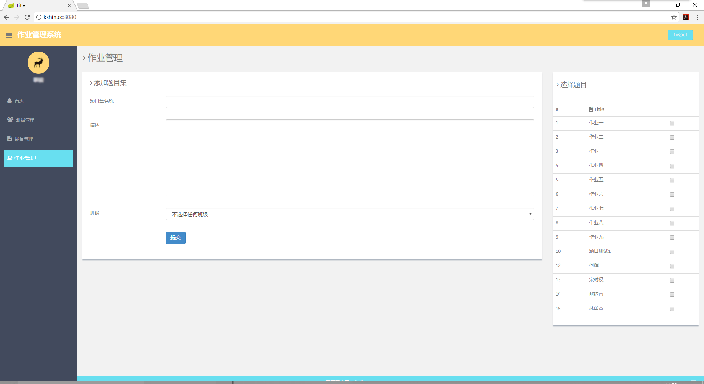

互联网编程技术课程设计
==========================

大二上学期互联网课程期末作业要求任选一课题设计制作一个有后台的，基于Java的WEB项目。恰好当时正在接触Spring相关框架的内容，因此打算用SpringBoot来实现该课程设计。 

作为学习过程的一个记录 

前端为BootStrap的模板DashGum免费版，配色很棒。 

[DashGum – Free Dashboard](http://www.blacktie.co/2014/07/dashgum-free-dashboard/) 
Author: [Black Tie](http://www.blacktie.co/) 

使用了Thymeleaf来替代jsp的相关内容（主要是懒） 

主要使用后端框架为： 
SpringBoot/SpringMVC+Spring+Spring Data JPA(hibernate) 

登陆界面使用了哈佛大学宣传片当作背景，以上如有侵权请告知删除。 

##需求

根据课程需要主要划分了作业管理的几个功能：
* 公共模块
    * 登陆登出
    * 身份识别
    * 注册账户（未实现）
    * 注销账户（未实现）
    * 个人信息模块
        * 查看个人信息
        * 修改个人信息（未实现）
* 学生模块
    * 查看作业列表
    * 提交作业
    * 修改提交（仅实现覆盖上次提交结果）
* 教师模块
    * 班级模块
        * 查看班级信息
        * 修改班级信息（未实现）
    * 题库模块
        * 添加题目
        * 编辑题目
        * 删除题目
    * 作业集模块
        * 从题库中选择若干题目新建作业
        * 编辑作业
        * 删除作业
        * 发布作业到指定班级
        * 查看作业提交状况（未实现）
     
 

目前仅实现了部分功能模块。

##部分效果

>登陆界面

>学生界面

>教师界面

##总结
初见SpringBoot时制作过程中踩了不少的雷，但同时也感受到了以注解的方式代替配置文件的便利性。 
就大二刚学习WEB时作为作业来说堪堪算是过关。但许多功能并未实现，也有相当一部分代码限于当时的知识面，做的十分不尽人意。怕是不能作为学习参考的样例，不过当作反面教材也是极好的（滑稽 
